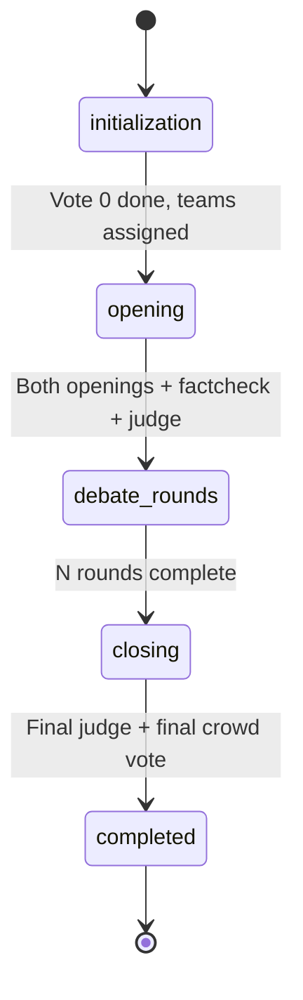
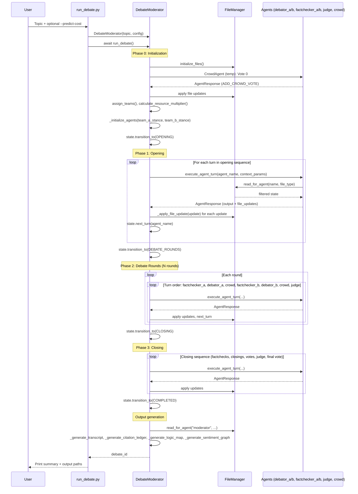
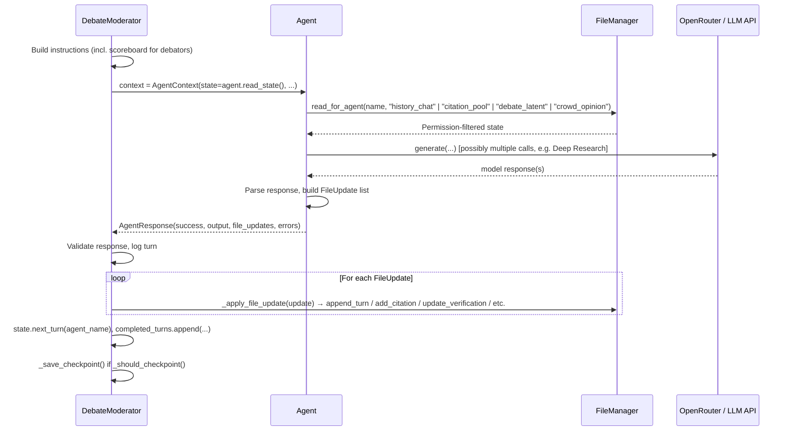
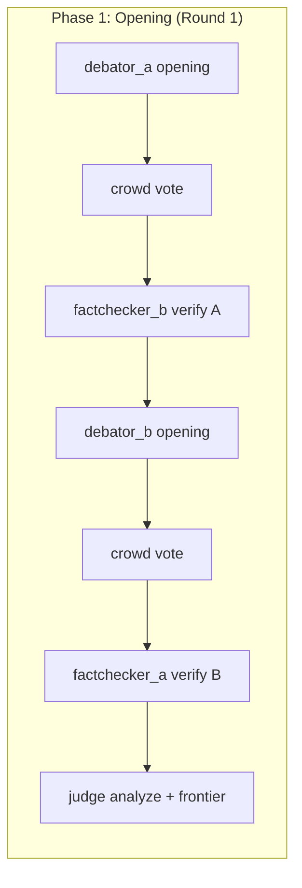
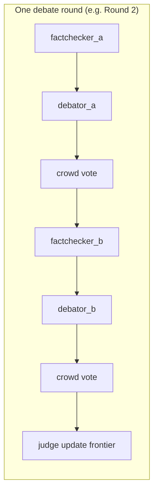
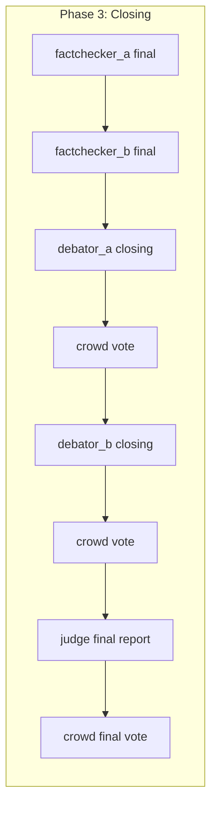
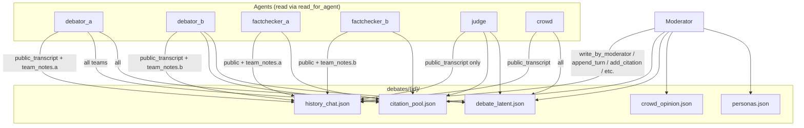
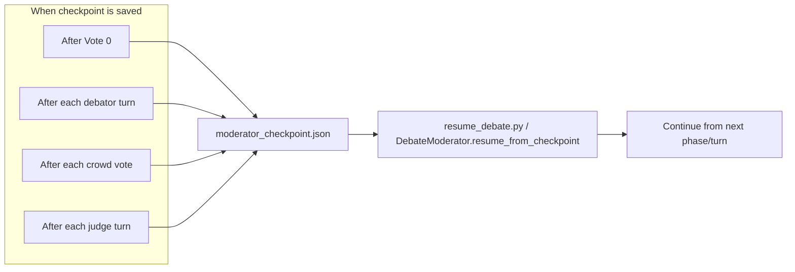

# AI Debate Platform — Debate Flow Schematics

This document describes the architecture and provides visual schematics of the debate flow. Use a Mermaid-compatible viewer (GitHub, VS Code, or [mermaid.live](https://mermaid.live)) to render the diagrams.

---

## 1. High-Level Architecture

The platform is organized in **layers**: the Moderator orchestrates everything; agents never talk to each other directly—they read/write through the Moderator and the File Manager.

```
┌─────────────────────────────────────────────────────────┐
│                    Moderator Layer                       │
│         (Orchestration, State Machine, Checkpoints)      │
└─────────────────────────────────────────────────────────┘
                            │
                            ▼
┌─────────────────────────────────────────────────────────┐
│                 Agent ↔ Moderator Protocol               │
│     AgentContext (in) → Agent → AgentResponse (out)       │
│     File updates applied only by Moderator               │
└─────────────────────────────────────────────────────────┘
                            │
            ┌───────────────┼───────────────┐
            ▼               ▼               ▼
┌─────────────────┐ ┌─────────────────┐ ┌─────────────────┐
│  Agent Layer    │ │  File Manager    │ │  State Manager   │
│  6 agent types  │ │  Permission-based│ │  Phase, round,   │
│  (read-only I/O)│ │  read/write JSON │ │  turn, teams     │
└─────────────────┘ └─────────────────┘ └─────────────────┘
                            │
                            ▼
                  ┌──────────────────┐
                  │  debates/{id}/    │
                  │  *.json files    │
                  └──────────────────┘
```

**Principles:**
- **Immutable state from agents’ perspective**: Agents only read (via `read_for_agent`). All writes go through the Moderator using `FileManager.write_by_moderator` or specific methods like `append_turn`, `add_citation`, etc.
- **Permission matrix**: Each agent sees only what it’s allowed to (e.g. judge sees `public_transcript` only; debators see their team’s notes; crowd does not see citation pool in default config).
- **Single writer**: Only the Moderator applies `FileUpdate` operations returned by agents.

---

## 2. Debate Phase State Machine

Phases advance strictly in order. No skipping or going back.



**Phase summary:**

| Phase | Purpose |
|-------|--------|
| **initialization** | Create debate dir, generate crowd personas, run **Vote 0** (stance preference), assign teams (winner → Team A), set resource multiplier, create all agents |
| **opening** | Round 1: Debator A → crowd vote → FactChecker B → Debator B → crowd vote → FactChecker A → Judge (frontier map) |
| **debate_rounds** | Rounds 2..N: For each round — FactChecker A → Debator A → crowd → FactChecker B → Debator B → crowd → Judge |
| **closing** | Final factcheck (both) → Debator A closing → crowd → Debator B closing → crowd → Judge final report → Final crowd vote |
| **completed** | Generate outputs (transcript, citation ledger, logic map, sentiment CSV) |

---

## 3. End-to-End Debate Flow (Sequence)

End-to-end flow from topic to outputs:



---

## 4. Single-Turn Flow (Execute Agent Turn)

What happens on every `execute_agent_turn(agent_name, context_params)`:



---

## 5. Opening Phase — Turn Order (Round 1)

Exact sequence in Phase 1:



---

## 6. Debate Round (Phase 2) — One Round

One full debate round (repeated `num_debate_rounds` times):



---

## 7. Closing Phase — Turn Order



---

## 8. Data Flow (Files and Permissions)

Agents read through the File Manager; only the Moderator writes.



---

## 9. Checkpoint and Resume

Checkpoints are saved after expensive or critical steps so the debate can be resumed without re-running prior LLM calls.



---

## 10. Output Artifacts (After COMPLETED)

Generated under `debates/{id}/outputs/`:

| File | Source data | Description |
|------|-------------|-------------|
| `transcript_full.md` | history_chat | Human-readable transcript (public + optional team notes) |
| `citation_ledger.json` | citation_pool | All citations with verification scores |
| `debate_logic_map.json` | debate_latent | Frontier / round history from judge |
| `voter_sentiment_graph.csv` | crowd_opinion | Per-round, per-voter scores for sentiment analysis |

---

## Summary

- **One orchestrator**: `DebateModerator` runs the state machine and every agent turn.
- **Strict phase order**: initialization → opening → debate_rounds → closing → completed.
- **Turn order** is fixed per phase (see diagrams above); agents never speak out of order.
- **State lives in JSON files**; agents read via permission-aware `FileManager`, and only the Moderator writes.
- **Recovery**: checkpoints after Vote 0, debator turns, crowd votes, and judge turns enable resume via `resume_debate.py`.

Use these schematics for onboarding or to reason about changes to the debate flow (e.g. adding a phase or a new agent type).
